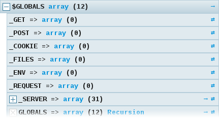
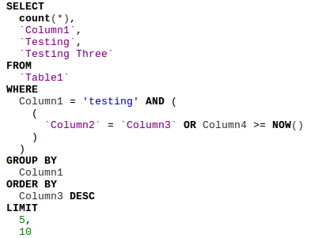

# com.ixiam.modules.kint

- Adds [Kint](https://kint-php.github.io/kint/) library for enhace variable debuging
- Adds [SqlFormatter](https://github.com/jdorn/sql-formatter) library for formatting sql statements.

**Kint**


**SqlFormatter**



The extension is licensed under [AGPL-3.0](LICENSE.txt).

## Requirements

* PHP v5.6+ / v7.x
* CiviCRM 4.x / 5.x

## Usage

Once the libray is installed, printout functions are available for debugging your CiviCRM extensions
- **q($var)**: prints out $var with sql format and syntax highlights
- **qd($var)**: prints out $var with sql format and syntax highlights
- **d($var)**: prints out $var in rich mode using kint
- **s($var)**: prints out $var in plain mode using kint
- **dd($var)**: calls **d()** and **die()**
- **sd($var)**: calls **s()** and **die()**
- **dr($var)**: calls **d()** and returns $var
- **sr($var)**: calls **s()** and returns $var


### Modifiers

Modifiers are a way to change Kint output without having to use a different function. Simply prefix your call to kint with a modifier to apply it:

- **!**   Expand all data in this dump automatically
- **+**   Disable the depth limit in this dump
- **-**   Attempt to clear any buffered output before this dump
- **@**   Return the output of this dump instead of echoing it
- **~**   Use the text renderer for this dump

Example:

```
+Kint::dump($data); // Disabled depth limit
!d($data); // Expanded automatically
```


More examples [here](https://kint-php.github.io/kint/#use)
